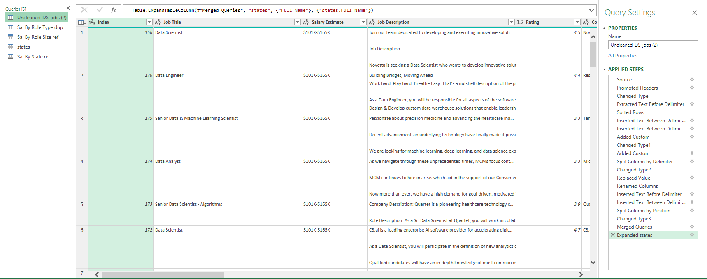
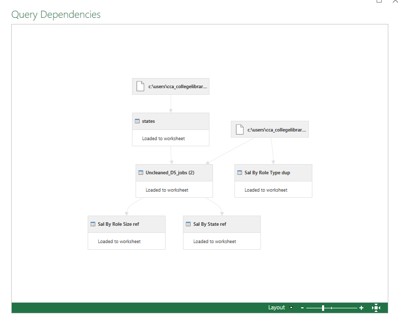

## Midterm Lab Task 2 - Data Cleaning and Transformation Using Power Query Editor 
In this task we are give a raw data from csv to perform data cleaning and transformation using power query

## Task Description:
Company X would like to extract some useful information from the UnclenedDSJObs csv taken
from a Job Posting site available in Kaggle. There are a lot of columns available but focus only
on generating insights that will answer the ff: questions
1. ex. Which Job Roles pay the highest and least
2. What size companies pay the best
3. Where Job Roles or Job Titles pay the best and least in a specific state

## Step 1
- Download and Save a Copy of the dataset (Uncleaned_DS_jobs.csv)
- Load the Data in Excel (Data → New Query → Open File → text/csv)
- Load & Edit in Power Query Editor
  
### Data Cleaning Task
- Remove all characters after ( in Salary Estimate Column (Transform → Extract → Text Before Delimiter ()
- Create Min Salary and Max Salary Columns (Add Column → Column from Examples → From Selections)
- Add Role Type Column (Add Column → Custom Column → Use job title conditions)
- Change Data Type to Text
- Split Location Column by delimiter , (Transform → Split Column)
- Create Location Correction Column using conditional formulas
- Rename Location Correction 2 to State Abbreviations
- Split Company Size Column to MinCompanySize and MaxCompanySize
- Handle negative values (Filter -1s in Competitors, Revenues, and Industry Columns)
- Clean Company Name (Remove extra characters)
- Remove Unnecessary Columns
- Save Proof of Data Cleaning Steps (Home → Advanced Editor → Copy Code)
### Reshaping and Grouping Data
- Duplicate raw data (Sal By Role Type dup)
- Select Columns: Role Type, Min Sal, Max Sal
- Convert Min & Max Sal to currency and multiply by 1000
- Group data by Role Type (Transform → Group By → Average Min and Max Salary)
- Reference raw data for Sal By Role Size ref
- Select Columns: Size, Min Sal, Max Sal
- Convert Min & Max Sal to currency and multiply by 1000
- Group data by Size (Transform → Group By → Average Min and Max Salary)
- Merge State Mapping File with Unclean DS Jobs using State Abbreviation
- Rename merged column to State Full Name
- Remove NULLs and blanks in State Abbreviation
- Reference raw data for Sal By State ref
- Select Columns: State Full Name, Min Sal, Max Sal
- Convert Min & Max Sal to currency and multiply by 1000
- Group data by State Full Name (Transform → Group By → Average Min and Max Salary)
## Dataset Before Cleaninng and Transformation(Screenshot)

## Dataset After cleaning and Transformation (Screenshot)

### Screenshot every queries
#### Sal by Role Type dup

#### Sal by Role Size ref

#### Sal by States ref

## Viewing Dependencies and References(SEE Screenshot)

